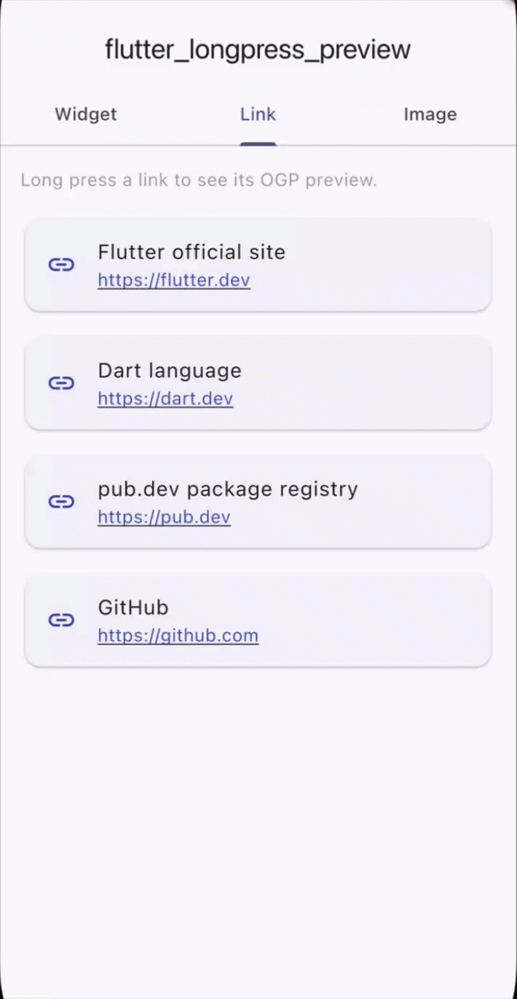
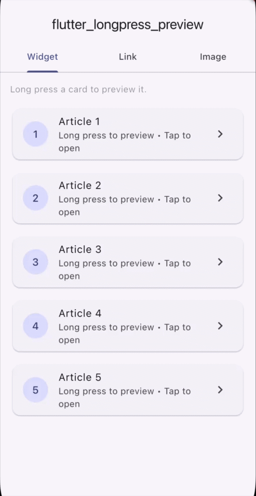
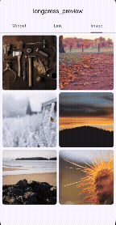

# longpress_preview

[](https://pub.dev/packages/longpress_preview)
[](https://pub.dev/packages/longpress_preview/score)
[](LICENSE)
[](https://flutter.dev)

A Flutter package that shows a preview popup on long press, inspired by Safari's link preview and Instagram's peek feature. Supports any widget, automatic URL/OGP link previews, and zoomable image previews — with smooth animations, blur backdrop, and drag-to-dismiss.

<p float="left">
  
  
  
</p>

---

## Features

- **Universal widget preview** — wrap any widget with `LongPressPreview` to peek at any content before committing to a tap.
- **Automatic OGP link previews** — `LongPressLinkPreview` fetches Open Graph metadata (title, description, image, favicon) from any URL and renders a rich card.
- **Zoomable image previews** — `LongPressImagePreview` shows an enlarged, pinch-to-zoom view of any `ImageProvider`.
- **Three animation styles** — `scaleFromChild` (Safari-style), `slideFromBottom` (Instagram-style), `fadeIn`.
- **Blur backdrop** — frosted glass background behind the popup.
- **Drag-to-dismiss** — swipe the popup down to close it.
- **Haptic feedback** — medium impact on long press (configurable).
- **In-memory OGP cache** — repeated previews for the same URL are instant.
- **Fully customisable** — colours, sizes, border radius, animation duration, loading/error widgets, and custom preview builders.
- **Dart 3 / Flutter 3.10+** — null-safe, uses records, switch expressions.

---

## Installation

Add to your `pubspec.yaml`:

```yaml
dependencies:
  longpress_preview: ^0.1.0
```

Then run:

```sh
flutter pub get
```

---

## Usage

### 1. LongPressPreview — any widget

Wrap any widget to preview arbitrary content on long press.

```dart
import 'package:longpress_preview/longpress_preview.dart';

LongPressPreview(
  preview: MyDetailWidget(),   // shown in the popup
  child: MyThumbnailWidget(),  // the widget that receives the long press
  onTap: () => Navigator.push(context, ...),
  onPreviewOpen: () => debugPrint('opened'),
  onPreviewClose: () => debugPrint('closed'),
)
```

#### With custom config

```dart
LongPressPreview(
  preview: MyDetailWidget(),
  config: const PreviewConfig(
    animation: PreviewAnimation.slideFromBottom,
    previewHeight: 400,
    borderRadius: 24,
    backgroundColor: Color(0xFF1C1C1E),
    barrierColor: Color(0xAA000000),
    animationDuration: Duration(milliseconds: 300),
    enableHaptics: true,
  ),
  child: MyThumbnailWidget(),
)
```

---

### 2. LongPressLinkPreview — automatic OGP card

Fetches Open Graph metadata from the URL and shows a rich card with the OGP image, title, description, site name, and favicon.

```dart
LongPressLinkPreview(
  url: 'https://flutter.dev',
  child: Text(
    'Flutter',
    style: TextStyle(color: Colors.blue, decoration: TextDecoration.underline),
  ),
  onTap: () => launchUrl(Uri.parse('https://flutter.dev')),
)
```

#### With a custom preview builder

```dart
LongPressLinkPreview(
  url: 'https://dart.dev',
  previewBuilder: (context, ogpData) {
    return MyCustomCard(data: ogpData);
  },
  child: const Text('Dart'),
)
```

#### Web / CORS proxy support

```dart
LongPressLinkPreview(
  url: 'https://example.com/article',
  proxyUrl: 'https://my-cors-proxy.example.com/?url=',
  child: const Text('Article'),
)
```

---

### 3. LongPressImagePreview — zoomable image

Long-pressing shows the full image with optional pinch-to-zoom. Pass a `heroTag` that matches the destination screen to get a seamless Hero transition when navigating.

```dart
LongPressImagePreview(
  imageProvider: NetworkImage('https://example.com/photo.jpg'),
  enableZoom: true,
  heroTag: 'photo_42',
  config: const PreviewConfig(
    backgroundColor: Colors.black,
  ),
  onTap: () => Navigator.push(context, PhotoDetailRoute()),
  child: ClipRRect(
    borderRadius: BorderRadius.circular(8),
    child: Image.network(
      'https://example.com/photo.jpg',
      fit: BoxFit.cover,
    ),
  ),
)
```

Works with any `ImageProvider`: `NetworkImage`, `AssetImage`, `FileImage`, etc.

```dart
LongPressImagePreview(
  imageProvider: const AssetImage('assets/photo.jpg'),
  child: const SizedBox(width: 80, height: 80, child: FlutterLogo()),
)
```

---

## PreviewConfig reference

| Property | Type | Default | Description |
|---|---|---|---|
| `previewHeight` | `double?` | 60% of screen height | Maximum height of the popup |
| `previewWidth` | `double?` | 90% of screen width | Width of the popup |
| `borderRadius` | `double` | `16.0` | Corner radius of the popup |
| `backgroundColor` | `Color` | `Colors.white` | Background colour of the popup |
| `barrierColor` | `Color` | `0x88000000` | Colour of the dimmed backdrop |
| `animationDuration` | `Duration` | `220ms` | Open/close animation duration |
| `animation` | `PreviewAnimation` | `scaleFromChild` | Animation style |
| `enableHaptics` | `bool` | `true` | Haptic feedback on long press |
| `longPressDuration` | `Duration` | `500ms` | How long to hold before preview opens |

### PreviewAnimation values

| Value | Description |
|---|---|
| `PreviewAnimation.scaleFromChild` | Scales up from the child's position (Safari-style) |
| `PreviewAnimation.slideFromBottom` | Slides up from the bottom of the screen (Instagram-style) |
| `PreviewAnimation.fadeIn` | Simple opacity fade |

---

## LongPressLinkPreview reference

| Property | Type | Default | Description |
|---|---|---|---|
| `url` | `String` | required | URL to fetch OGP data from |
| `child` | `Widget` | required | Trigger widget |
| `config` | `PreviewConfig` | `PreviewConfig()` | Appearance config |
| `proxyUrl` | `String?` | `null` | CORS proxy prefix for web |
| `showFavicon` | `bool` | `true` | Show site favicon in card |
| `showDescription` | `bool` | `true` | Show OGP description |
| `maxDescriptionLines` | `int` | `3` | Max lines for description |
| `loadingWidget` | `Widget?` | `CircularProgressIndicator` | Custom loading state |
| `errorWidget` | `Widget?` | Text message | Custom error state |
| `previewBuilder` | `Widget Function(BuildContext, OgpData)?` | `null` | Fully custom preview widget |
| `onPreviewOpen` | `VoidCallback?` | `null` | Called when popup opens |
| `onPreviewClose` | `VoidCallback?` | `null` | Called when popup closes |
| `onTap` | `VoidCallback?` | `null` | Called on normal tap |

---

## LongPressImagePreview reference

| Property | Type | Default | Description |
|---|---|---|---|
| `imageProvider` | `ImageProvider` | required | Image to show in preview |
| `child` | `Widget` | required | Trigger widget (thumbnail) |
| `config` | `PreviewConfig` | `PreviewConfig()` | Appearance config |
| `enableZoom` | `bool` | `true` | Pinch-to-zoom in preview |
| `heroTag` | `Object?` | `null` | Hero animation tag |
| `onTap` | `VoidCallback?` | `null` | Called on normal tap |

---

## Platform support

| Platform | Supported |
|---|---|
| Android | Yes |
| iOS | Yes |
| macOS | Yes |
| Web | Yes (use `proxyUrl` for OGP fetching due to CORS) |
| Windows | Yes |
| Linux | Yes |

> **Note:** Haptic feedback (`enableHaptics`) is a no-op on platforms that do not support it (web, desktop). No error is thrown.

---

## How OGP fetching works

`OgpFetcher.fetch(url)` makes a single HTTP GET request with a bot `User-Agent`, parses the HTML for `og:*` / `twitter:*` meta tags, and falls back to the `<title>` tag and `<meta name="description">`. Results are cached in a static `Map` for the lifetime of the app. Call `OgpFetcher.clearCache()` to flush the cache.

On Flutter Web, same-origin policy prevents direct fetching of arbitrary URLs. Pass a `proxyUrl` (e.g. a simple server-side proxy or a CORS-anywhere instance) to route requests through it.

---

## Example app

A full example app is included in the `example/` directory demonstrating all three widget types across three tabs.

```sh
cd example
flutter run
```

---

## Contributing

Pull requests are welcome. Please open an issue first to discuss significant changes.

1. Fork the repository.
2. Create a feature branch: `git checkout -b feat/my-feature`.
3. Commit your changes following [Conventional Commits](https://www.conventionalcommits.org/).
4. Open a pull request.

---

## License

MIT License. See [LICENSE](LICENSE) for details.
